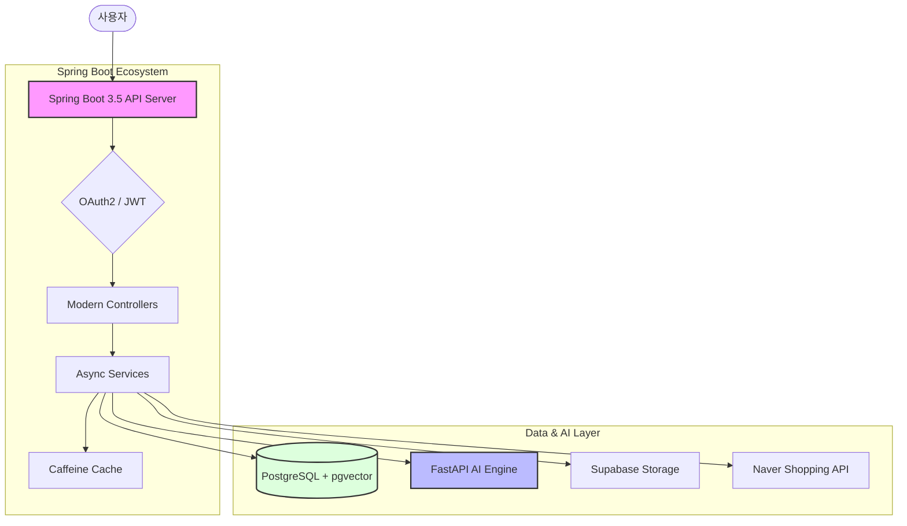

# 👗 NineOunce Fashion API: AI 기반 비주얼 서치 및 맞춤형 추천 시스템

본 프로젝트는 AI 이미지 분석과 클라우드 인프라를 결합하여 사용자에게 패션 아이템을 추천하는 백엔드 서비스입니다. 최신 Java 21 및 Spring Boot 3.5 기능을 집약하여 성능과 가독성을 극대화했습니다.

---

## 🌟 프로젝트 개요

NineOunce는 외부 AI 분석 엔진(**FastAPI**)과의 효율적인 연동을 통해 이미지 기반의 **비주얼 서치(Visual Search)** 기능을 제공하는 Spring Boot 기반의 데이터 처리 서버입니다. 사용자가 업로드한 이미지를 분석하여 유사한 스타일의 아이템을 찾아주는 지능형 추천 서비스를 핵심으로 합니다.

---

## 🛠 기술 스택 및 도입 배경

### 🚀 Java 21 & Spring Boot 3.5 Modernization

- **Virtual Threads (Project Loom)**: `spring.threads.virtual.enabled=true`를 활성화하여 I/O 차단 시 OS 스레드를 점유하지 않는 경량 스레드 모델을 도입했습니다. 높은 처리량(Throughput)과 효율적인 리소스 관리를 보장합니다.
- **Sequenced Collections**: `getFirst()`, `getLast()` 등 표준화된 메서드를 사용하여 리스트 순서에 따른 데이터 접근 가독성을 높였습니다.
- **Pattern Matching for `instanceof`**: 타입 검사와 형 변환을 동시에 수행하는 최신 문법을 적용하여 코드의 안정성과 간결함을 확보했습니다.
- **Declarative HTTP Interfaces**: `HttpServiceProxyFactory`를 사용하여 외부 API(FastAPI) 통신을 인터페이스 기반의 선언적 방식으로 구현, 서비스 로직과 통신 로직을 완벽히 분리했습니다.

### 💾 Data & Search Efficiency
- **PostgreSQL & pgvector**: 관계형 데이터베이스 내에서 직접 벡터 유사도 검색(Cosine Distance)을 수행합니다. **HNSW** 인덱스를 활용하여 수십만 건의 상품 중 유사 스타일을 밀리초 단위로 찾아냅니다.
- **Hybrid Caching Service**: `Caffeine Cache`를 활용하여 잦은 API 요청과 분석 결과를 메모리에 캐싱함으로써 응답 속도를 최적화했습니다.

### AI 연동 및 외부 통신 (AI & Integrations)
*   **External AI Engine (FastAPI)**: 이미지 분석 및 특징점 추출을 담당하는 독립적인 AI 엔진과 연동하여 고도화된 추론 성능을 확보했습니다.
*   **Declarative HTTP Interface**: 연동 시 Spring Boot 3의 최신 HTTP 인터페이스 방식을 사용합니다. 장황한 통신 코드 없이 인터페이스 선언만으로 외부 AI 서비스를 비즈니스 로직에 통합했습니다.

### 🔐 Security & Cloud Integration
- **OAuth2 & JWT**: 구글, 네이버, 카카오 소셜 로그인 연동 및 무상태(Stateless) JWT 인증 필터를 통해 확장성 있는 보안 아키텍처를 구축했습니다.
- **Supabase Cloud Storage**: 대용량 이미지 자산을 Supabase Storage에 보관하고, 공용 URL을 통해 CDN 가속을 지원합니다.

---

## 🏗 시스템 아키텍처



---

## 🚀 주요 핵심 기능

### 1. AI 기반 스마트 비주얼 서치
사용자가 이미지를 업로드하면 딥러닝 모델이 스타일 특징점(768/1024차원 벡터)을 추출합니다. 이 벡터값을 프로젝트 내 `pgvector` 엔진과 대조하여 가장 유사한 스타일의 상품 상위 10개를 결과로 반환합니다.

### 2. 하이브리드 추천 엔진
- **실시간 네이버 트렌드**: 네이버 쇼핑 API를 통해 실시간 인기 상품 정보를 동적으로 반영합니다.
- **내부 인벤토리 검색**: NineOunce 자체 DB에 등록된 유니크한 패션 아이템들 중에서 유사 스타일을 추천합니다.

### 3. 스타일 트렌드 리포트 (DataLab API)
네이버 데이터랩의 검색 트래픽 데이터를 분석하여 카테고리별 유행 스타일을 시각화하고 인사이트를 제공합니다.

---

## 📖 개발자 문서 및 환경 설정

### API 명세서 (Swagger)
OpenAPI 3.1 규격에 따라 모든 API에 대한 요청/응답 예시와 명세를 자동 생성합니다.
- **주소**: `http://localhost:8080/swagger-ui.html`

### 1. 환경 변수 설정
프로젝트 루트에 `.env` 파일을 생성하고 아래의 필수 환경 변수들을 설정해야 합니다. (기존 `.env` 참조)
- `DB_PASSWORD`, `JWT_SECRET`
- OAuth2 클라이언트 ID/Secret (Google, Naver, Kakao)
- `SUPABASE_URL`, `SUPABASE_KEY`
- `app.fastapi.url` (분석 엔진 주소)

### 2. 로컬 실행 (Local Development)
- **필수 환경**: JDK 21, PostgreSQL 15+ (`pgvector` 확장 필요)
- **DB 준비**:
  ```sql
  CREATE EXTENSION IF NOT EXISTS vector;
  ```
- **실행**:
  ```bash
  ./gradlew clean bootRun
  ```

### 3. Docker 실행 (Containerization)
제공된 `Dockerfile`을 사용하여 컨테이너 환경에서 애플리케이션을 구동할 수 있습니다.
- **이미지 빌드**:
  ```bash
  docker build -t ninebounce-api .
  ```
- **컨테이너 실행**:
  ```bash
  docker run -p 8080:8080 --env-file .env ninebounce-api
  ```

---

