# Fashion API (NineOunce E-Commerce Backend)

> 패션 이커머스 서비스(**NineOunce**)를 위한 **Spring Boot 기반 백엔드 API 서버**입니다. 
> AI를 활용한 시각적 검색(Visual Search) 및 추천, 소셜 로그인 기반의 안전한 회원 관리, 트렌드 분석 등 첨단 쇼핑 인사이트 기능을 제공합니다.

## 🚀 주요 기술 스택 (Tech Stack)

### Backend Core
- **Framework**:  Spring Boot 3.5.10
- **Language**:  Java 21
- **Build Tool**:  Gradle
- **Database**:  PostgreSQL (Supabase 환경 연동)
- **ORM**:  Spring Data JPA / Hibernate 6

### Security & Authentication
- **Spring Security** & **OAuth2 Client**:  (Google, Naver, Kakao 소셜 로그인 지원)
- **JWT (JSON Web Token)**:  (`com.auth0:java-jwt`) 세션리스 인증 아키텍처 구현

### AI & Integration
- **FastAPI 연동**:  Python 기반 외부 분석 서버(포트 8000, 8001) 통신 (512D/768D 벡터 임베딩)
- **pgvector**:  벡터 검색(Vector Similarity Search) 기반 코사인 유사도 연산

### Storage & Utility
- **Storage**:  회원 프로필 사진 및 원본 분석 이미지 보관
- **API Docs**:  API 명세 자동화 및 테스트 UI (`/swagger-ui.html`)
- **P6Spy**: 개발 환경 실행 쿼리 파라미터 모니터링
- **MapStruct**: DTO-Entity 간 자동 변환 (컴파일 타임 에러 체크)
- **Caffeine Cache**: 트렌드 조회 등 성능 최적화용 로컬 인메모리 캐시

---

## 🛠 아키텍처 및 핵심 기술 심층 분석 (Technical Deep Dive)

단순히 라이브러리를 조립하는 수준을 넘어, 대용량 트래픽과 AI 기반 시각 정보 처리의 성능 최적화, 그리고 유지보수성을 모두 고려하여 다음과 같은 최신 기술을 코드 레벨에 깊이 있게 적용했습니다.

### 1. ⚡ Java 21 가상 스레드 (Virtual Threads) 기반 논블로킹 I/O
- **도입 배경:** AI 이미지 분석과 같이 무거운 연산을 외부 FastAPI 서버로 위임하는 구조에서, 응답 대기로 인한 수 초의 네트워크 연결 지연(Latency)이 동반되었습니다. 기존 시스템에서는 이러한 구간에서 플랫폼 동시접속 스레드가 블로킹되어 빠르게 스레드 풀이 고갈되는 병목 현상이 발생했습니다.
- **해결 방안:** Java 21의 가벼운 '가상 스레드(Virtual Threads)' 기능을 `application.properties`에 즉시 도입하고 논블로킹 패러다임을 활성화했습니다.
- **기대 효과:** 서버 램(Memory) 고갈 없이 수천 명의 동시 접속자가 AI 검색을 요청해도 안정적으로 응답을 대기하고 분배할 수 있게 되어, 시스템 동시성(Throughput) 성능이 사실상 무제한에 가깝게 비약적으로 향상되었습니다.

### 2. 🧠 PostgreSQL `pgvector`를 활용한 대규모 벡터 엔진 조인
- **도입 배경:** 각 상품의 이미지를 512차원 혹은 768차원 다차원 배열 벡터로 인코딩한 방대한 데이터를 애플리케이션(Java단) 메모리로 가져와 반복 컴퓨팅으로 유사도를 비교할 경우, 즉각적인 `Out Of Memory` 발생과 응답 마비가 심각했습니다. 
- **해결 방안:** 상품 간 유사성 척도 및 스타일 클러스터링을 DB 엔진 단락에서 즉시 연산·해결하도록 PostgreSQL의 강력한 `pgvector` 확장을 활용하여 데이터 계층의 조인 네이티브 쿼리를 직접 구축했습니다.
- **기대 효과:** 불필요한 네트워크 대역폭 송수신 부하를 모두 분리했습니다. 검색 속도가 수십 배 이상 최적화되었을 뿐 아니라, 기존의 고정형(Static) 데이터베이스 관계 모델에서 AI가 지속 매핑하는 `top1_style` 동적 추천 모델링으로 시스템을 유연하게 진화시켰습니다.

### 3. 🛡️ 완전 분산 보안(Stateless)을 위한 Cookie 기반 OAuth2 및 Filter 체계
- **도입 배경:** 폭발적인 트래픽 대응용 스케일 아웃(Scale-out) 시, 기존 HTTP Session을 유지하려면 막대한 비용의 Redis와 같은 세션 클러스터링 인프라가 필수적입니다. 또한 Spring Security의 소셜 로그인 흐름 통제 자체에선 일부 데이터 단락의 세션 저장이 강제됩니다. 
- **해결 방안:** 백엔드 로그인 검증에 개입되는 세션 메커니즘을 100% 암호화된 `HTTP-Only` 쿠키 단으로 우회 재구현(`AuthorizationRequestRepository`) 하였으며, 성공 직후 JWT 식별 토큰만을 교환하는 필터단을 전면 설계했습니다.
- **기대 효과:** 단 1%의 세션도 서버에 남기지 않는 완전한 무상태(Stateless) 클라우드 로직을 완성했습니다. 악의적 요청 등을 비즈니스 로직이 아닌 서비스 진입 맨 처음 시점인 필터 단에서 신속하게 차단하여 백엔드 리소스 누수를 최소화하고 보안 레벨을 견고히 잡았습니다.

### 4. 🔗 Spring 6 선언적 HTTP 클라이언트 (Declarative HTTP Interfaces)
- **도입 배경:** 외부 FastAPI (AI 모듈 서버) 통신 로직에 기존 `RestTemplate`나 복잡한 빈 매핑 `FeignClient`를 사용하면 런타임 시 보일러플레이트 코드가 기하급수적으로 늘어나고 타임아웃 방어에 어려움이 발생합니다. 
- **해결 방안:** Spring 6의 가장 강력한 최신 통신 기능인 100% 논블로킹 엔진 Reactor Netty 기반의 **Declarative HTTP Interfaces (`@HttpExchange`)** 어댑터를 커스텀 튜닝(커넥션 풀 500개 확장, 120s 장기 타임아웃 세션 방어)하여 연동했습니다. 
- **기대 효과:** 통신 구조의 모든 직관적 결합도를 느슨하고 깔끔한 어노테이션 기반 인터페이스 단위로 압축하여 코드 추적 및 유지보수성을 극대화했습니다. 아무리 무거운 AI 연산이 길어져도 끊임없이 안전하게 데이터 소켓을 방어합니다. 

### 5. 🚀 MapStruct 매핑 자동화 및 로컬 파이프라인 (Caffeine Cache) 구축
- **도입 배경:** 클라이언트로 전송될 DTO 간 계속된 변경과 직렬/역직렬화에 기존 런타임 리플렉션 기술을 적용하면 구조적 응답 지연을 초래합니다. 더불어, 고정적인 메인 추천 트렌드 상품들을 매번 DB 통신으로 연산하는 막대한 I/O 낭비가 존재했습니다.
- **해결 방안:** 컴파일 빌드 단계 시점에 매핑 최적화 코드를 프레임워크가 자동 생성하는 `MapStruct` 도입 및 빠른 인메모리 반응형 데이터를 전달할 목적의 로컬 한정 `Caffeine Cache`를 동시 기용했습니다. 
- **기대 효과:** 애플리케이션의 런타임 객체 변환 지연율(Latency 오버헤드)을 'Zero' 단상으로 차단하였으며 실시간 트렌드 조회에 있어 DB 콜 발생 부담을 거의 완벽히 덜어냈습니다.

### 6. 🏞️ 구조적 영속성 분리 (Supabase Storage 독립 파일 연동망)
- **도입 배경:** 유저 프로필 등 사용자에 의해 등록된 무거운 대용량 바이너리 파일을 직접 RDBMS의 Byte Blob으로 관리하면 인프라 마이그레이션 백업 및 트랜잭션 용량에 곧바로 치명상을 입힙니다.
- **해결 방안:** Supabase Storage 버킷 전용 API 연동망 규격을 통해, 바이너리 팩 저장소는 별도 외부 퍼블릭 스토리지로 던지고 백엔드 테이블에는 해당 자산의 공개 HTTP URL(`default.svg` 등) 텍스트 명칭 하나만 기록되도록 로직을 분리시켰습니다. 
- **기대 효과:** RDBMS 비대화를 단번에 종식시켰습니다. 클라우드 스토리지를 응용하여 가볍고 초고속인 글로벌 응답을 제공, 프론트엔드에서 즉각 이미지가 스트리밍 로딩 렌더링되는 체감 성능 향상을 크게 이끌어 냈습니다.

---

## 🔌 시스템 모듈 및 주요 API 명세 (Key Features & Endpoints)

프로젝트는 주요 도메인 및 용도별 컨트롤러(`*Controller`)로 깔끔하게 분리되어 있습니다.

### 1. 👕 AI 시각 검색 및 상품 추천 (`/api/recommand`)
| Method | Endpoint | Description |
|:---:|---|---|
| **GET** | `/api/recommand/{productId}` | 512D 벡터 기준 유사도 측정 및 네이버/내부 상품 추론 반환 |
| **GET** | `/api/recommand/768/{productId}` | 고밀도 다차원(768D) 모델을 이용한 스케일 업 상품 추천 |
| **POST** | `/api/recommand/analyze` | (Multipart) 업로드된 이미지를 인식해 가장 유사한 핏 매칭 |

### 2. 👥 회원 관리 및 소셜 인증 (`/api/members`)
| Method | Endpoint | Description |
|:---:|---|---|
| **POST** | `/api/members/login` | 로컬 로그인 처리 및 JWT Access Token 동적 발급 |
| **POST** | `/api/members/signup` | 신규 회원가입 및 프로필 이미지 저장 지원 |
| **GET** | `/api/members/me` | 토큰을 기반으로 현재 호출 중인 사용자의 세부 정보 반환 |
| **PATCH** | `/api/members/update` | 닉네임, 비밀번호 등 회원 정보 단건 수정 |

### 3. 🛍️ 관심 상품 (위시리스트) (`/api/save-products`)
| Method | Endpoint | Description |
|:---:|---|---|
| **POST** | `/api/save-products` | 네이버 외부 쇼핑몰 상품 ID와 스타일 속성을 연동해 보관 |
| **GET** | `/api/save-products` | 위시리스트에 담긴 모든 외부 상품 및 스타일 정보 일괄 조회 |
| **DELETE** | `/api/save-products` | `List<String>` 형태로 여러 건의 위시리스트를 한 번에 삭제 |

### 4. 📈 트렌드 분석 및 시스템 로깅 (`/api/trends`, `/api/logs`)
| Method | Endpoint | Description |
|:---:|---|---|
| **GET** | `/api/trends/shopping-insight` | 쇼핑 클릭 데이터를 역산한 베스트 트렌드 랭킹 스코어 계산 |
| **GET** | `/api/logs/view` | 브라우저 안에서 실시간 서버 로그(`fashion-api.log`) 뷰어 제공 |
| **GET** | `/map/768` (또는 `/map`) | 프론트엔드 UMAP 3D Scatter Plot 렌더링용 X/Y/Z 좌표 집합 반환 |

---

## 📂 프로젝트 아키텍처 레이어 (Layer Architecture)

```text
src/main/java/com/kdt03/fashion_api
 ├── config/        # CORS 통신, JWT, OAuth2 보안 정책, 가상 스레드, WebClient 전역 설정 모듈
 ├── controller/    # HTTP 기반 RESTful API 엔드포인트 진입 경로 및 문서 매핑 매개체
 ├── domain/        # 데이터베이스 엔티티 (JPA Entities) + 입체 XYZ 벡터 좌표계 및 도메인 모델
 │   └── dto/       # 클라이언트 단방향 전송 객체 모음집 (불변성 보장)
 ├── repository/    # JpaRepository 확장 인터페이스 (Vector 유사도 계산 Query 및 Native Join)
 ├── service/       # 트랜잭션(@Transactional) 처리를 중심으로 비즈니스 플로우를 통제하는 로직
 └── util/          # JWT 커스텀 디코딩 및 발급 토큰화(Payload 분석) 등 필수 공통 함수 집합
```

---

## 💻 실행 및 배포 가이드 (How to run locally & Deploy)

### 필요 환경 변수 구축 (.env 작성 요령)
현재 사용 중인 루트 경로 폴더에 `.env` 파일을 만들거나 시스템 혹은 런타임 환경 변수에 아래의 항목들을 반드시 설정해야 데이터 연결과 소셜 통신이 구동됩니다. (로컬과 Docker 환경 모두 공용 필수)

```ini
# Database & General Security Auth
DB_PASSWORD=your_supabase_postgres_password
JWT_SECRET=your_super_secret_jwt_signature_key

# OAuth2 External Providers
OAUTH2_GOOGLE_CLIENT_ID=your_google_id
OAUTH2_GOOGLE_CLIENT_SECRET=your_google_secret
OAUTH2_NAVER_CLIENT_ID=your_naver_id
OAUTH2_NAVER_CLIENT_SECRET=your_naver_secret
OAUTH2_KAKAO_CLIENT_ID=your_kakao_id
OAUTH2_KAKAO_CLIENT_SECRET=your_kakao_secret
```

### 🐳 Docker 통합 컨테이너를 이용한 배포와 실행 (권장 방안)
성능 저하 및 레이어 분리를 극대화하기 위해 제공 중인 **Multi-stage Build (멀티 스테이지 빌드 최적화)** 방식의 `Dockerfile`입니다 (JDK로 무거운 용량의 빌드 컴파일을 진행한 후 마지막엔 매우 가벼운 JRE 환경만 넘겨서 자원을 절약합니다).

1. **Docker 최적화 이미지 빌드 시작**
   ```bash
   docker build -t fashion-api:latest .
   ```
2. **배포용 컨테이너 실행**
   준비한 환경 변수를 넘겨주며 내장 톰캣 전용 8080 포트를 점유하여 컨테이너를 구동 및 백그라운드 활성화합니다.
   ```bash
   docker run -d -p 8080:8080 \
     --env-file .env \
     --name fashion-backend \
     fashion-api:latest
   ```
3. 부팅 상태 확인 및 에러 검색: `docker logs -f fashion-backend`

### 💻 OS 시스템 터미널 구동 가이드 (Docker 미사용 / 로컬 테스트용)
플랫폼 제약이나 종속성 다운로드를 예방하기 위한 `gradlew` 래퍼 파일이 코드에 동봉되어 있으므로, Java 21이 이미 인스톨되어 있다면 즉각 테스트가 가능합니다. 터미널 경로를 본 프로젝트(fashion-api)로 이동하십시오.

```bash
# Windows (CMD, PowerShell 등의 환경)
> gradlew.bat build -x test
> gradlew.bat bootRun

# macOS / Linux (Mac의 경우 만약 권한 거부 시 사전에 권한 부여: chmod +x gradlew)
$ ./gradlew build -x test
$ ./gradlew bootRun
```

### 🔗 백엔드 API 서비스 접속 및 Swagger 디버깅 테스트
- **Swagger 인터페이스 UI**: 서버 구동이 완료된 후 브라우저 메인 주소창에 `http://localhost:8080/swagger-ui.html` URL을 명시하여 이동하시면, 내부에 코딩된 모든 백엔드 API 들을 간편하고 직관적으로 파라미터를 넘겨주며 직접 호출하고 테스트해 볼 수 있습니다.

---

## 🗄️ 데이터베이스 스키마 구조 (Entity Relationship Diagram)

서비스에서 운용 중인 Supabase(PostgreSQL)의 전체 테이블 및 연관 관계를 요약한 다이어그램입니다. `pgvector`가 적용된 모델(`_vectors_512`, `_vectors_768`) 및 3D 시각화가 지원되는 모델(`_xyz_`) 등이 포함되어 있습니다.

```mermaid
erDiagram
    %% ==========================================
    %% 1. 사용자 및 인증 도메인 (User & Auth)
    %% ==========================================
    member {
        int seq PK
        string id UK
        string password
        string nickname
        string provider "OAuth2 로그인(Local, Google 등)"
        string profile
    }
    stores {
        string store_id PK
        string store_name
    }

    %% ==========================================
    %% 2. 메타데이터 도메인 (Category & Style)
    %% ==========================================
    categories {
        string category_id PK
        string category_name
    }
    styles {
        string style_id PK
        string style_name
    }

    %% ==========================================
    %% 3. 상품 도메인 (Products)
    %% ==========================================
    nineounce_products {
        string product_id PK
        string product_name
        int price
        string image_url
        string category_id FK
        string style_id FK
    }
    naver_products {
        string product_id PK
        string title
        int price
        string product_link
        string image_url
        string category_id FK
        string style_id FK
    }

    categories ||--o{ nineounce_products : "분류"
    categories ||--o{ naver_products : "분류"
    styles ||--o{ nineounce_products : "스타일 지정"
    styles ||--o{ naver_products : "스타일 지정"

    %% ==========================================
    %% 4. 트랜잭션 도메인 (Action & Log)
    %% ==========================================
    save_products {
        bigint save_id PK
        string member_id FK
        string naver_product_id FK
        string style_id FK 
        timestamp created_at
    }
    sales {
        int sale_id PK
        string product_id FK
        int sale_quantity
        int sale_price
    }
    sales_log {
        bigint seq PK
        string store_id FK
        string product_id FK
        int sale_quantity
        date sale_date
    }

    member ||--o{ save_products : "추가"
    naver_products ||--o{ save_products : "대상"
    nineounce_products ||--o{ sales : "판매"
    nineounce_products ||--o{ sales_log : "기록"
    stores ||--o{ sales_log : "통계"

    %% ==========================================
    %% 5. AI 모델링 도메인 (Vectors & 3D)
    %% ==========================================
    naver_product_vectors_512 {
        string product_id FK
        float top1_score
        string top1_style FK
    }
    naver_product_vectors_768 {
        string product_id FK
        float style_score1
        string style_top1 FK
    }
    nineounce_product_vectors_512 {
        string product_id FK
        float top1_score
        string top1_style FK
    }
    nineounce_product_vectors_768 {
        string product_id FK
        float style_score1
        string style_top1 FK
    }
    nineounce_xyz_512 {
        string product_id FK
        float x 
        float y 
        float z 
        string top1_style FK
    }
    nineounce_xyz_768 {
        string product_id FK
        float x 
        float y 
        float z 
        string top1_style FK
    }

    naver_products ||--o| naver_product_vectors_512 : "512D"
    naver_products ||--o| naver_product_vectors_768 : "768D"
    nineounce_products ||--o| nineounce_product_vectors_512 : "512D"
    nineounce_products ||--o| nineounce_product_vectors_768 : "768D"
    nineounce_products ||--o| nineounce_xyz_512 : "3D(512)"
    nineounce_products ||--o| nineounce_xyz_768 : "3D(768)"
```


